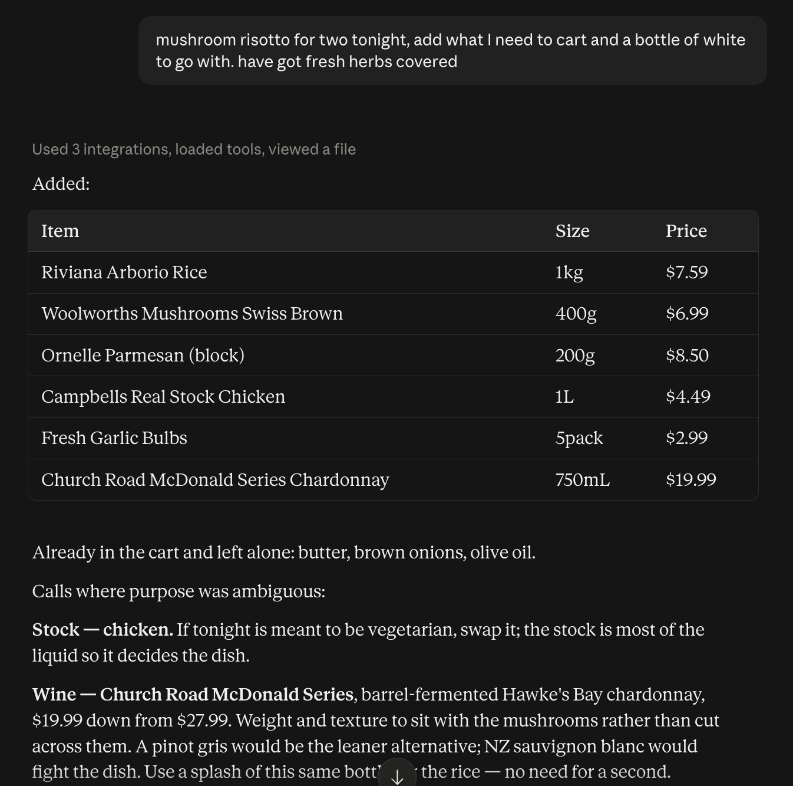

# woolies-mcp

An MCP server for shopping the [Woolworths New Zealand](https://www.woolworths.co.nz) catalogue:
keyword search, product detail, and the delivery location those answers depend on.



The catalogue tools are read-only and need no account. Once signed in it can also read and fill
your trolley — but it never places an order, pays, or books a delivery slot.

**Authentication is human-driven.** A browser window opens and you sign in there, as you would on
the website — the server never sees your password and stores no credentials. It keeps only the
resulting session, which Woolworths expires after 7 days. See [DESIGN.md](DESIGN.md) for the API
facts and the rules the server holds to.

This is an unofficial project, not affiliated with Woolworths — please read
[Unofficial, and what this is not](#unofficial-and-what-this-is-not) before using it.

## Contents

- [Tools](#tools)
- [Requirements](#requirements)
- [Run it](#run-it)
- [Add it to Claude Code](#add-it-to-claude-code)
- [Shopping skill](#shopping-skill-recommended)
- [Running it over HTTP](#running-it-over-http) — [Docker](#docker), [Synology NAS](#deploying-to-a-synology-nas-optional), [Tailscale Funnel](#publishing-with-tailscale-funnel-optional)
- [Politeness](#politeness)
- [Layout](#layout)
- [Restore](#restore)
- [Unofficial, and what this is not](#unofficial-and-what-this-is-not)

## Tools

| Tool                                                                    | What it does                                                                                                                                                                 |
| ----------------------------------------------------------------------- | ---------------------------------------------------------------------------------------------------------------------------------------------------------------------------- |
| `search_products(query, page?, sort?, department?, includeOutOfStock?)` | Keyword search. Returns compact products, `matchesAvailable`, a coverage line, and category counts carrying browse slugs. In-stock only unless asked otherwise; 40 per page. |
| `search_products_batch(queries, resultsPerQuery?, department?)`         | Several searches in one call, grouped by query.                                                                                                                              |
| `get_product(sku)`                                                      | One product by SKU: breadcrumb, description, ingredients, claims, nutrition, origins, purchasing unit.                                                                       |
| `get_product_label(sku)`                                                | The packaging photo, as an image block, for when the label is the only source.                                                                                               |
| `get_location()`                                                        | The suburb, fulfilment method and store the session is shopping from.                                                                                                        |
| `set_location(suburb)`                                                  | Switches to a New Zealand suburb. An ambiguous name returns the matches instead of guessing.                                                                                 |
| `list_categories(department?)`                                          | The browse tree: departments, or one department's aisles and shelves.                                                                                                        |
| `browse_category(department, aisle?, shelf?, page?, sort?)`             | Products in a category, by the slugs `list_categories` returns.                                                                                                              |
| `get_specials(department?, page?, sort?)`                               | What is on special, optionally in one department.                                                                                                                            |
| `find_stores(query?)`                                                   | Pick-up locations by name or address fragment, one row per store with its regions.                                                                                           |

### Account tools

| Tool                                            | What it does                                                                    |
| ----------------------------------------------- | ------------------------------------------------------------------------------- |
| `auth_status()`                                 | Whether the session is signed in, and until when. Read-only.                    |
| `sign_in()`                                     | Reports how to sign in; the server cannot do it unattended (see below).         |
| `get_cart()`                                    | What is in the trolley, with the trolley total.                                 |
| `set_cart_quantity(sku, quantity, pricingUnit)` | Sets a line to an absolute quantity; 0 removes it. Decimals for `Kg`.           |
| `set_cart_quantities(items)`                    | Several lines in one call, with a per-item outcome.                             |
| `remove_from_cart(sku, pricingUnit?)`           | Removes a line.                                                                 |
| `get_past_purchases()`                          | Purchase history, returned separately from Woolworths' promotional suggestions. |
| `get_order_history()`                           | Past orders, for the site's default recent window.                              |

Sign-in happens in a real browser. Auth0 challenges non-browser clients with a captcha, so
`npm run login` opens a window, you sign in, and the captured session is handed to the server,
which persists it and reloads it at boot. The shop session lasts 7 days.

**No checkout, ever.** There is no tool for placing an order, paying, or booking a delivery slot,
and the upstream endpoints for those are deliberately left unbound. A person reviews the trolley
and places the order on the website.

> **Quantities can change on the way in.** Woolworths rounds weight-priced products up to a whole
> number of items, so 0.3 kg of loose bananas becomes 0.5 kg. Cart writes return
> `requestedQuantity` and `appliedQuantity` separately and set `adjusted` with an explanation
> when they differ. Report what was applied, never what was asked for.

`npm run smoke:account` runs the cart sequence and restores the trolley; `npm run check:login`
checks the sign-in chain without credentials; `npm run check:adjustment` checks the
quantity-adjustment wording offline.

## Requirements

Node 20 or newer. The catalogue tools need no account; the cart tools need `npm run login`.

## Run it

```sh
npm install
npm run build
npm start          # stdio; speaks JSON-RPC on stdout, logs on stderr
```

`npm run check` runs typecheck, lint, format check and build — the pre-push command. `npm run
lint:fix` and `npm run format` apply what is fixable. CI runs the same four on Node 20 and 22.

`npm run smoke` exercises the live API end to end against its own anonymous session, throttled to
one request per second, and prints a pass/fail line per check. `npm run typecheck` covers `src`
and `scripts`.

## Add it to Claude Code

From anywhere, after `npm install && npm run build` in this directory:

```sh
claude mcp add woolies --scope user -- node /absolute/path/to/woolies-mcp/dist/index.js
```

Drop `--scope user` to register it for the current project only. Check it with
`claude mcp list`, and remove it with `claude mcp remove woolies`.

## Shopping skill (recommended)

The tools alone leave the caller to work out the order of operations. `skills/woolies/` is an
[Agent Skill](https://agentskills.io) that supplies it: check the delivery location before
quoting prices, resolve each list item, batch the cart write, and report ambiguous picks
instead of choosing silently. Worth adding once the server is connected.

```sh
ln -s "$PWD/skills/woolies" ~/.claude/skills/woolies      # Claude Code
```

Copy it instead of symlinking if you want to tailor it — pointing it at wherever you keep your
shopping lists and preferences is the main thing worth changing. For claude.ai, upload it in the
skills settings; its frontmatter is limited to the Agent Skills spec so it uploads unchanged.

Then ask for the shopping in the normal way, or invoke it directly with `/woolies`.

## Running it over HTTP

Two entry points share one `createServer`:

| Entry           | Command              | Used for                             |
| --------------- | -------------------- | ------------------------------------ |
| stdio           | `node dist/index.js` | local use, launched by an MCP client |
| Streamable HTTP | `node dist/http.js`  | remote use over HTTP                 |

`node dist/http.js` serves the same tools over Streamable HTTP, which is what a hosted MCP client
connects to. Any host that runs Node or Docker will do; the sections below describe one
arrangement, and none of it is required for local stdio use.

The HTTP transport serves MCP **only** at `/mcp/$MCP_PATH_TOKEN`. `/healthz` returns a version
string with no secrets, and every other path returns 404 with an empty body. The token is an
unguessable path, not authentication. It guards a session that can read and fill the signed-in
trolley, so treat the token as a credential.

Copy `.env.example` to `.env` and fill it in. Generate the token with `openssl rand -hex 24`.

### Docker

`docker-compose.yml` builds the image, reads `.env`, and binds to `127.0.0.1:8480` — a reverse
proxy or tunnel is expected to publish it, not the port itself. Create `data/` next to the compose
file and `chown 1000:1000` it: the container runs as the unprivileged `node` user and stores the
signed-in session there.

```sh
docker compose up -d
```

### Deploying to a Synology NAS (optional)

One convenience path, not a requirement — any host that runs `docker compose` works, by whatever
means you already use.

Prerequisites:

- DSM 7 with Container Manager installed, which provides `docker` and compose v2.
- SSH enabled, and an ssh alias with key auth for a user with passwordless sudo. Docker needs
  sudo on DSM.
- The deploy directory created on the NAS, containing a `data/` subdirectory owned by `1000:1000`.
  The container runs as the unprivileged `node` user and stores the signed-in session there.
- For Funnel only: the Tailscale package sideloaded from
  [pkgs.tailscale.com](https://pkgs.tailscale.com/stable/#synology) — the Package Center build
  lags badly — with HTTPS certificates and Funnel enabled for the tailnet.

Set `DEPLOY_SSH_HOST` to the ssh alias and `DEPLOY_REMOTE_DIR` to the deploy directory, then:

```sh
npm run deploy            # or: npm run deploy -- my-nas
```

It ships HEAD as a tarball over SSH rather than using scp, because DSM disables SFTP and this way
the NAS needs no git credentials. It copies `.env` only when the NAS has none, builds the image
there, and waits for `/healthz`. It refuses to run with a dirty tree, since HEAD is what ships.

Non-login SSH on DSM has a minimal PATH, so docker is called by absolute path with sudo;
`DEPLOY_DOCKER_PATH` overrides that for other hosts.

### Publishing with Tailscale Funnel (optional)

A hosted MCP client calls the endpoint from the internet, so a LAN address will not do. Funnel
gives the host a public HTTPS URL with no open ports, no domain and no certificates:

```sh
tailscale funnel --bg 8480
```

Enable HTTPS certificates and Funnel once for the tailnet in the Tailscale admin console; the
first `funnel` run prints an approval link if the policy has not been set. The resulting hostname
is `<node>.<tailnet>.ts.net` — put it in `PUBLIC_BASE_URL`.

Whole-port Funnel is safe here because the app serves MCP only at `/mcp/$MCP_PATH_TOKEN` and 404s
everything else. Anything else that reaches port 8480 gets nothing.

Verify from outside:

```sh
npm run check:http <public-base-url> <token>
```

Then sign in once, which the cart tools need:

```sh
npm run login -- --server <public-base-url>/mcp/<token>
```

Substitute the `PUBLIC_BASE_URL` and `MCP_PATH_TOKEN` values from your `.env`; these commands do
not read it for you.

## Politeness

One session, one request per second, a single retry with backoff, and an automatic re-bootstrap
when the edge rejects the session. This is one shopper's traffic and must stay that way; the
throttle lives in `WoolworthsClient` so no tool can route around it.

## Layout

```
src/
  index.ts              stdio entry point
  http.ts               Streamable HTTP entry point
  server.ts             tool registration, transport-agnostic
  config.ts             environment parsed once, at startup
  session-store.ts      the signed-in session on disk, shared by both entry points
  tools/                MCP adapters: argument schemas, descriptions, JSON responses
  woolworths/
    session.ts          cookie jar, browser headers, bootstrap
    client.ts           throttle, retry, re-bootstrap, JSON
    auth.ts             sign-in state; the handover itself is scripts/login.ts
    schemas.ts          zod schemas for the site's payloads
    mappers.ts          raw JSON to the compact shapes a client sees
    api.ts              the Woolworths operations, in domain terms
scripts/
  login.ts              browser sign-in handover
  smoke.ts              live catalogue check
  account-smoke.ts      live cart check, signed in
  deploy.ts             ship, build and start on a remote host
```

## Restore

This repository plus one git-ignored `.env` recreates the deployment. The only state worth
keeping is the signed-in session under `/data`; losing it costs one `npm run login`.

For the local stdio server: `git clone`, `npm install`, `npm run build`, and register it with your
client (the `claude mcp add` line above, for Claude Code).

To rebuild the NAS deployment from nothing:

1. `git clone` this repository on the machine you deploy from.
2. `cp .env.example .env` and paste `MCP_PATH_TOKEN` back from your password manager. Reusing the
   same token keeps the existing connector URL working; a new one changes the URL and every client
   must be updated.
3. On the NAS, create the deploy directory's `data/` and `chown 1000:1000` it — the
   container runs as the unprivileged `node` user and stores the session there.
4. `npm run deploy` — ships HEAD to `DEPLOY_REMOTE_DIR`, builds, starts, waits for health.
5. `sudo /var/packages/Tailscale/target/bin/tailscale funnel --bg 8480` on the NAS, if the serve
   config was lost too.
6. `npm run check:http <public-base-url> <token>`.
7. `npm run login -- --server <public-base-url>/mcp/<token>` to sign in again.

Keep copies of every secret in your password manager; none belongs in this repository.

## Unofficial, and what this is not

Not affiliated with, endorsed by, or connected to Woolworths New Zealand or Woolworths Group. All
trademarks belong to them.

It automates one person's own account for their own household shopping: the same actions a shopper
takes in the browser, at a shopper's volume. It is not a scraper, a price-harvesting tool, or a
data-collection service, and the code is built so it cannot drift into being one — a single shared
session, roughly one request per second enforced in the HTTP client where no tool can bypass it,
no bulk crawling, and no redistribution of catalogue or price data. Results are fetched on demand
for the person asking and are not stored or republished.

It intentionally cannot place orders, pay, or book delivery slots. Those endpoints exist upstream
and are deliberately left unbound. Filling a trolley is as far as it goes; a person opens the
website to check out.

The project and its author collect nothing. There is no telemetry and no phoning home. Your
session cookies, `.env` and any personal data stay in your own deployment, on your own machine.

You are responsible for complying with Woolworths' Terms of Service — read them and decide for
yourself whether this use fits. It drives the website's own internal API, which carries no
compatibility promise and can change without notice; the schemas are strict so an upstream change
surfaces as an error rather than as wrong data. Use at your own risk. Provided as-is, with no
warranty of any kind.

MIT licensed.
